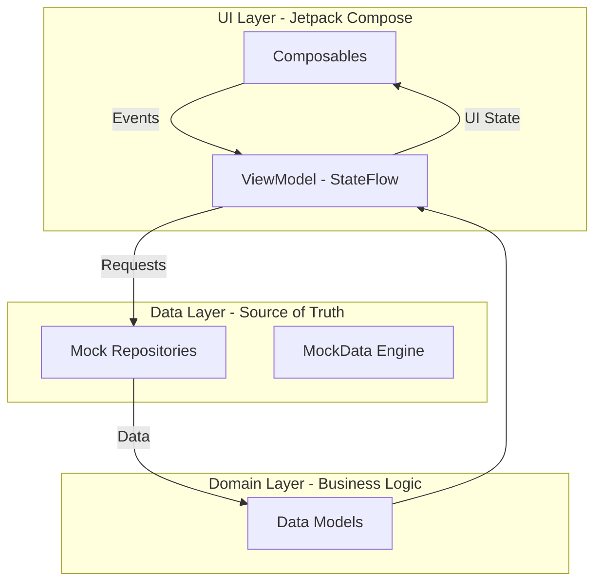
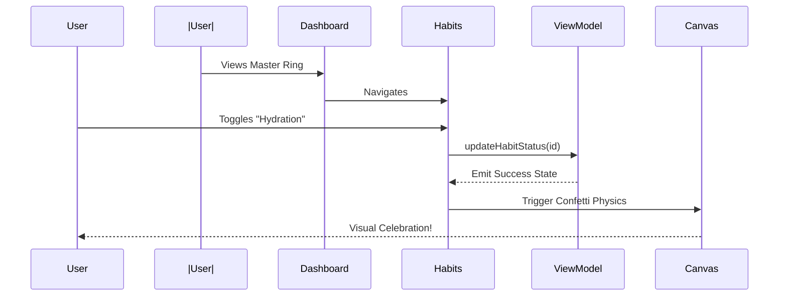

# 
💎 Lumina Growth 💎

  
  
  
  

---

## 🌟 Overview
**Lumina Growth** is an ultra-modern, high-fidelity personal development application built from the ground up to explore the absolute limits of **Jetpack Compose**. Developed as an intensive education project, it serves as a playground for mastering advanced Kotlin features, high-performance custom drawing, and complex animation states in Android.

This isn't just a habit tracker; it's a **living UI showcase** designed to provide a premium, "Apple-level" user experience while maintaining a clean, scalable architectural foundation.

---

## 📸 Visual Showcase

  
  
  

  
  
  

  
  
  

---

## 🚀 "The Wow Factors" (Technical Highlights)

### 🛸 1. Atmospheric Particle Engine
Lumina features a background that feels alive. We implemented a custom **Canvas-based Particle System** where "stardust" floats upwards, interacting with moving **Aurora Blobs**. 
- **Tech**: `rememberInfiniteTransition`, `DrawScope.drawCircle`, real-time delta-time calculations.

### 💎 2. Premium Glassmorphism 2.0
Every card in Lumina isn't just semi-transparent. They feature:
- **Inner Glow**: Custom border gradients that pulse.
- **Backdrop Interaction**: Dynamic transparency that shifts based on the moving background blobs.
- **Blur Simulation**: Fine-tuned opacity layers to create the illusion of frosted glass.

### 📈 3. Neon Mood Analytics (Custom Drawing)
Forget standard charting libraries. We built a custom **Path-based Line Chart** with:
- **Glow Brushes**: Multi-stop linear gradients applied to the stroke.
- **Dynamic Scaling**: Paths that animate and scale based on the historical mood data.
- **Shadow Fills**: Vertical gradients that create a volumetric feel under the data line.

### 🎊 4. Physics-Based Celebration
Completing a task shouldn't be boring. Lumina triggers a **Confetti Burst** using a custom particle physics engine:
- **Gravity Simulation**: Particles have velocity, weight, and fade-over-time properties.
- **Randomization**: Colors and vectors are calculated on-the-fly for a unique "explosion" every time.

---

## 🏗️ Architecture & Flow

### 🧱 MVVM + Clean Architecture
The project follows a strict separation of concerns to ensure the "crazy visuals" don't turn into "spaghetti code".

### 🌊 User Interaction Flow

---

## 📊 MAD Score (Modern Android Development)

| Component | Status | Description |
| :--- | :--- | :--- |
| **Language** | 🟢 **100% Kotlin** | Utilizing Coroutines, Flow, and Functional paradigms. |
| **UI** | 🟢 **100% Compose** | Zero XML layouts. Full Material 3 implementation. |
| **Architecture** | 🟢 **Jetpack MVVM** | Using Lifecycle, ViewModel, and State-centric UI. |
| **Tooling** | 🟢 **Modern Stack** | Version Catalog (TOML), KSP, and Hilt. |

---

## 🛠️ Tech Stack & Credits

- **Kotlin**: Core language.
- **Jetpack Compose**: UI framework.
- **Material 3**: Design system.
- **Coroutines & Flow**: Reactive state management.
- **Navigation Compose**: Type-safe screen routing.
- **Canvas API**: Custom drawing for Charts, Rings, and Particles.
- **Hilt (Ready)**: Dependency injection infrastructure.

---

## 🎓 Learning Outcomes
This project was a deep dive into:
1.  **Mathematical Drawing**: Calculating offsets and paths for custom charts.
2.  **State Hoisting**: Managing complex UI interactions across fragmented screens.
3.  **Performance Optimization**: Running heavy animations and particle systems without dropping frames.
4.  **Modern Brand Design**: Understanding how to translate high-fidelity design prototypes into working Android code.

---

